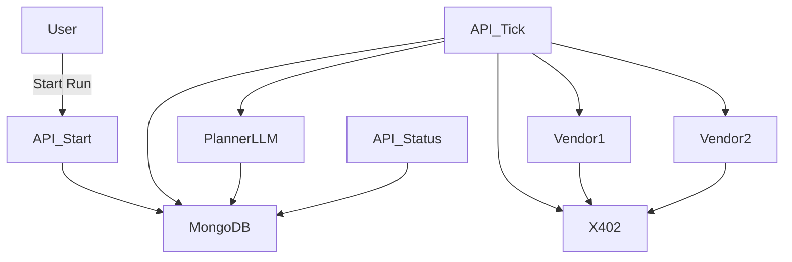
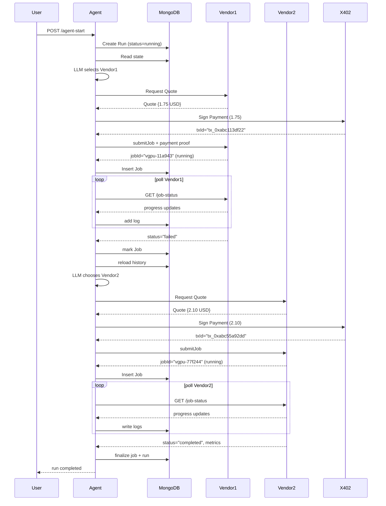

# 📘 GPU Procurement Agent — Autonomous Cloud GPU Rental Using LLM + MongoDB + x402

This project implements an **autonomous AI agent** capable of renting GPUs from multiple vendors, handling payments via **x402 / Coinbase CDP**, monitoring long-running training jobs, recovering from failures, and maintaining a complete execution history inside **MongoDB**.

Designed for the **"Prolonged Coordination"** hackathon theme, this agent survives restarts, handles vendor failures, and makes budget-aware decisions using an LLM-powered planner.

---

## 🚀 Overview

The agent performs a full lifecycle:

1. **User starts a run** (goal + budget)
2. Agent reads current state from MongoDB
3. LLM Planner selects a vendor based on:
   * price
   * reliability
   * past failures
   * remaining budget
4. Agent obtains quote from vendor
5. Agent performs **x402 payment challenge**
6. Agent submits GPU job
7. Agent periodically polls job status (stateless)
8. On failure — the agent automatically retries with a different vendor
9. On success — metrics + artifacts are saved

Everything is logged to MongoDB via `runs`, `jobs`, `payments`, and `observations`.

---

## 🏗️ System Architecture

```
┌─────────────────────────────────────────────────────────────────┐
│                         Client Layer                             │
│              (REST API: start, tick, status)                     │
└─────────────────────────────────────────────────────────────────┘
                              ↓
┌─────────────────────────────────────────────────────────────────┐
│                  Vercel Serverless Functions                     │
│                    (Stateless Execution)                         │
└─────────────────────────────────────────────────────────────────┘
                              ↓
┌─────────────────────────────────────────────────────────────────┐
│                      Agent Decision Engine                        │
│  ┌──────────────────┐         ┌────────────────────────────┐   │
│  │  LLM Planner     │────────>│   Vendor Selection         │   │
│  │  (Fireworks AI)  │         │   (Price + Reliability)    │   │
│  └──────────────────┘         └────────────────────────────┘   │
└─────────────────────────────────────────────────────────────────┘
              ↓                               ↓
┌──────────────────────────┐    ┌──────────────────────────────┐
│   MongoDB Atlas          │    │   x402 Payment Layer         │
│   (Persistent State)     │    │   (Coinbase CDP)             │
│                          │    │                              │
│  • runs                  │    │  • Auto payment challenge    │
│  • jobs                  │    │  • On-chain settlement       │
│  • payments              │    │  • Transaction receipts      │
│  • observations          │    └──────────────────────────────┘
│  • vendors               │                 ↓
└──────────────────────────┘    ┌──────────────────────────────┐
              ↑                  │   GPU Vendor APIs            │
              └──────────────────│   (Mock/Real Providers)      │
                                 │                              │
                                 │  • Get quote                 │
                                 │  • Submit job                │
                                 │  • Poll status               │
                                 └──────────────────────────────┘
```

---

## 🧠 Component Interaction



### Components

| Component | Description |
|-----------|-------------|
| **Vercel Serverless** | Stateless executor for each "tick" step |
| **MongoDB Atlas** | Durable state machine + logs |
| **Fireworks AI / Llama 3** | LLM planning + vendor selection |
| **x402 / CDP** | Payment challenges + tx receipts |
| **Mock GPU Vendors** | Simulated 402 flows, failures, training logs |

---

## 🔄 Failure Recovery — Sequence Diagram



---

## 📄 Failure Recovery JSON Log (Sample)

```json
{
  "run": {
    "_id": "679fdc0a9a4f5d03f2a9c7b1",
    "goal": "Fine-tune tiny-llm on dataset A",
    "status": "running",
    "budgetTotal": 5.0,
    "budgetRemaining": 2.45
  },
  "jobs": [
    {
      "_id": "679fdc1c9a4f5d03f2a9c7b2",
      "vendorId": "gpu_vendor_1",
      "status": "failed",
      "errorMessage": "Vendor crashed at 47% progress"
    },
    {
      "_id": "679fdc3e9a4f5d03f2a9c7b3",
      "vendorId": "gpu_vendor_2",
      "status": "completed",
      "artifactUrl": "https://mock-storage/gpu_vendor_2/model-final.bin"
    }
  ],
  "payments": [
    {
      "vendorId": "gpu_vendor_1",
      "status": "completed",
      "x402TxId": "tx_0xabc113df22"
    },
    {
      "vendorId": "gpu_vendor_2",
      "status": "completed",
      "x402TxId": "tx_0xabc55a92dd"
    }
  ],
  "observations": [
    {
      "type": "agent_reasoning",
      "content": "Vendor1 is cheapest; starting job"
    },
    {
      "type": "error",
      "content": "Vendor1 failed at 47%"
    },
    {
      "type": "agent_reasoning",
      "content": "Vendor1 failed previously; switching to vendor2"
    }
  ]
}
```

---

## 🛠️ Tech Stack

### Backend
- **TypeScript**
- **Node.js**
- **Vercel Serverless Functions**

### Storage
- **MongoDB Atlas**
  - `runs`
  - `jobs`
  - `payments`
  - `observations`
  - `vendors`

### AI
- **Fireworks AI / Llama 3**
- Deterministic fallback mode for testing

### Payments
- **x402 protocol**
- **Coinbase CDP** (signing + transaction receipts)
- Automatic 402 challenge retry

### Vendor Simulation
- Local mock GPU vendor services:
  - `/quote`
  - `/submit-job`
  - `/job-status`
  - configurable failure modes

---

## ▶️ Local Development

```bash
git clone https://github.com/Mister-Raggs/agentic-gpu-renter.git
cd agentic-gpu-renter
cp .env.example .env
npm install
```

### 1. Start mock vendor services

```bash
cd gpu-vendor-mock
npm install
GPU_VENDOR_SECRET="dev_secret_123" npm run dev
```

### 2. Seed MongoDB with vendors

```bash
cd agentic-gpu-renter
npm run seed:vendor
```

### 3. Start local dev API

```bash
npm run dev
```

---

## 📡 API Endpoints

| Endpoint | Method | Description |
|----------|--------|-------------|
| `/api/agent-start` | POST | Start a new run |
| `/api/agent-tick` | POST | Execute one decision/action cycle |
| `/api/agent-status` | GET | View run + jobs + payments + logs |

---

## 🧪 Demo Script (for judges)

1. Seed vendors
2. Start mock vendor services
3. `POST /agent-start` → shows run with full budget
4. Call `/agent-tick` repeatedly
   - Vendor1 quote OK
   - Payment complete
   - Job starts
5. Simulated vendor failure occurs
6. Agent logs error → switches to Vendor2
7. Second payment
8. Second job runs to completion
9. `/agent-status` shows full recovery trace
10. Show JSON log + sequence diagram (in README)

Total demo time: < **2 minutes**

---

## 📌 Key Features

- Stateless execution: every tick loads and stores state in MongoDB
- Full durable state machine
- LLM-based planning with JSON actions
- Automatic payment challenges + retries
- Retry logic across unreliable vendors
- Observability via typed event logs
- Drop-in replacement for real GPU providers

---

## 🧭 Future Work

- Add real GPU rental APIs (RunPod, Lambda, Vast) behind x402 wrappers
- Vendor reputation scoring via embeddings (Voyage AI)
- Automatic benchmarking of vendor performance
- Cost optimization planner
- Multi-agent negotiation between vendors

---

## 📚 Detailed Architecture

For deep technical dive into system design, component breakdown, and design decisions, see the inline documentation:

- [Agent Planner](agentic-gpu-renter/src/agent/planner.ts) - LLM-based decision making
- [x402 Client](agentic-gpu-renter/src/x402/client.ts) - Payment protocol integration
- [Vendor API](agentic-gpu-renter/src/gpu/vendorApi.ts) - GPU vendor abstraction
- [Data Models](agentic-gpu-renter/src/db/models.ts) - MongoDB schema

---

## 📝 Environment Variables

Create `agentic-gpu-renter/.env`:

```bash
MONGODB_URI=
MONGODB_DB_NAME=
FIREWORKS_API_KEY=
FIREWORKS_MODEL=accounts/fireworks/models/llama-v3-8b-instruct
GPU_VENDOR_SECRET=dev_secret_123
CDP_API_KEY_ID=
CDP_API_KEY_SECRET=
CDP_WALLET_SECRET=
PLANNER_MODE=stub  # or "llm"
```

---

Built with ❤️ for MongoDB Agentic AI Hackathon
